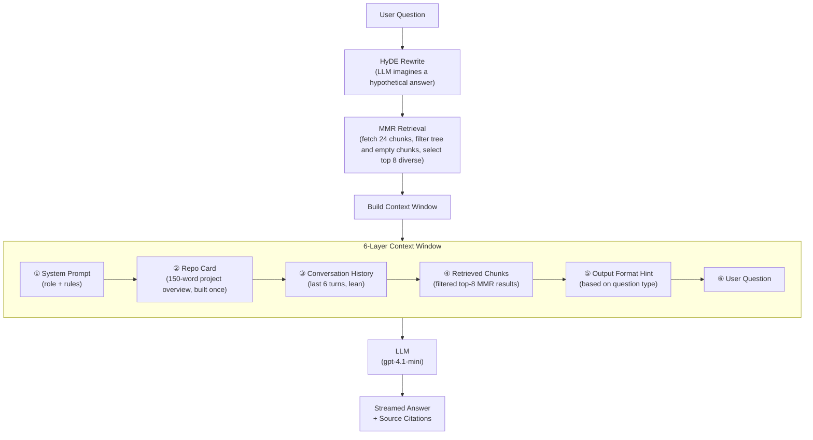

# Week 1 — Daily Deliverables

## Day 1 — Getting Started with Azure OpenAI & Prompt Engineering

**Date:** Day 1

### What I Did

The first day was mostly about getting familiar with the Azure OpenAI environment and running my first real API call. I started by setting up the development environment — installing the necessary packages, configuring the `.env` file with the Azure API keys, and making sure everything connected properly.

Once the setup was done, I moved on to building a small but meaningful script (`summary.py`) that takes a meeting transcript as input and generates a structured summary along with a list of action items — using the `gpt-4.1-mini` model deployed on Azure. The script uses streaming so the response appears token-by-token, which gave me a feel for how LLM outputs actually work in real time.

One thing I specifically focused on was **prompt engineering**. I studied the difference between weak and improved prompts, and included working examples as comments in the code:
- A weak prompt like *"Summarize this document"* vs. a better version that gives the model a role, a format, and a focus area.
- Similarly for extracting action items and classifying feedback.

### Key Implementations
- Connected to Azure OpenAI using the `AzureOpenAI` Python client
- Implemented **streaming** chat completions with `stream=True`
- Built a practical meeting summarizer with system and user roles
- Practiced writing structured, role-based prompts with clear output expectations

### What I Learned
- How to authenticate and call Azure OpenAI endpoints from Python
- The importance of the system prompt in shaping the model's behavior
- How streaming works — tokens come in chunks, not all at once
- Prompt quality directly affects output quality — vague prompts give vague results

---

## Day 2 — Multi-turn Conversations, Pydantic & Structured Output

**Date:** Day 2

### What I Did

Day 2 was about making LLM interactions more reliable and structured. The focus shifted from just getting responses to controlling exactly what shape those responses come in — and validating them properly using **Pydantic**.

**Multi-turn conversation** (`main.py`): Extended the basic API call to handle a real back-and-forth conversation. The message history is built up manually — each user and assistant turn is appended to the messages list before the next call. This made it clear how the model uses the full conversation to keep context.

**Interactive chat loop** (`interactive_chat.py`): Built a working terminal chat where the user types a message, the assistant responds with streaming, and the history is maintained across turns automatically. It exits cleanly when the user types `exit` or `quit`. Simple, but a good way to test how conversation memory works in practice.

**Structured output with Pydantic** (`invoking_llm.py` + `pydantic_validation.py`): This was the core focus of the day. `invoking_llm.py` defined the output schema as a raw JSON dict and used a manual `validate_ticket()` function to check field presence, enum values, and data types. `pydantic_validation.py` took this further using **actual Pydantic**:

- Defined `Category` and `Urgency` as `str, Enum` classes — so invalid values are rejected automatically
- Built a `SupportTicket` Pydantic `BaseModel` with typed fields and `Field` constraints (e.g., `min_length=1`)
- Used LangChain's `PydanticOutputParser` to wire the schema into a `ChatPromptTemplate` and form a clean chain with the `|` operator: `prompt | llm | parser`
- Used `llm.with_structured_output(SupportTicket, method="json_schema")` — LangChain's cleanest way to enforce a Pydantic model as the LLM's output format, with automatic parsing and `ValidationError` handling

**LangChain introduction** (`main_langchain.py`): Got hands-on with LangChain's `AzureChatOpenAI` wrapper and used `SystemMessage` / `HumanMessage` objects to structure calls cleanly. Also explored the idea of a GitHub RAG system — which became the foundation for Days 3 and 4.

### Key Implementations
- Multi-turn conversation history managed in a Python list
- Streaming terminal chat interface with clean exit handling
- JSON schema output enforcement + manual `validate_ticket()` for field and enum checking (`invoking_llm.py`)
- **`pydantic_validation.py`** — proper Pydantic `BaseModel` (`SupportTicket`) with `Category` and `Urgency` `Enum` fields and `Field` constraints
- `PydanticOutputParser` wired into a `ChatPromptTemplate` using the LangChain `|` chain syntax: `prompt | llm | parser`
- `llm.with_structured_output(SupportTicket, method="json_schema")` — automatic parsing and `ValidationError` handling with zero boilerplate

### What I Learned
- There's a real difference between *mimicking* Pydantic with a manual dict check and *using* Pydantic — enums, type coercion, and `Field` constraints do the heavy lifting for you
- `with_structured_output()` is the cleanest way to get a typed Pydantic object back from an LLM call — no manual JSON parsing needed
- The `|` operator in LangChain chains (LCEL) makes it easy to compose prompt → model → parser in a readable, modular way
- Catching `ValidationError` separately from general exceptions is good practice — it tells you exactly which field failed and why

---

## Day 3 — Naive RAG Pipeline: From Documents to Answers

**Date:** Day 3

**Focus:** Build and retrieve repo knowledge.

### What I Did

Day 3 was all about building a clean knowledge base from our codebase and establishing a solid retrieval pipeline. Instead of asking the LLM to answer from memory, we first pull relevant information from our own documents and include it in the prompt. I explored every stage of the RAG pipeline and built a working version using local policy files (`remote_work_policy.txt`, `travel_expense_policy.txt`, `customer_data_handling_policy.txt`).

The core of this day is the **"knowledge base building"** part. The focus is strictly on document chunking, embeddings, metadata, and retrieval quality — not on how the final answer is arranged.

The flow is always the same: **load → chunk → embed → store → retrieve → answer**.

---

**Step 1 — Load Documents**

Different loaders handle different file types:

| Loader | What it handles |
|--------|----------------|
| `TextLoader` | Plain `.txt` files |
| `PyPDFLoader` | PDF documents |
| `UnstructuredWordDocumentLoader` | `.docx` Word files |
| `CSVLoader` | Spreadsheet / CSV data |

Used `TextLoader` to load the three policy text files.

---

**Step 2 — Chunk Documents**

Long documents need to be split into smaller pieces before they can be embedded. Three common splitters:

- **`CharacterTextSplitter`** — splits at a specific character (e.g., `\n\n`), fast and simple
- **`TokenTextSplitter`** — splits by token count, maps directly to what the model sees
- **`RecursiveCharacterTextSplitter`** — tries natural boundaries first (paragraphs → sentences → words) before falling back to characters; the most commonly used option *(used here)*

Two settings that matter:
- **`chunk_size`** — the max length of each chunk (characters or tokens). Bigger = more context per chunk, but fewer chunks fit in the prompt.
- **`chunk_overlap`** — how much text is shared between adjacent chunks. Prevents losing context that falls right at a boundary.

Used `RecursiveCharacterTextSplitter(chunk_size=1000, chunk_overlap=200)`.

---

**Step 3 — Embed Chunks**

Each chunk is converted into a vector that captures its meaning. Similar chunks land close together in vector space. Common options:

| Embedding | Notes |
|-----------|-------|
| `AzureOpenAIEmbeddings` | Azure-hosted OpenAI *(used here)* |
| `OpenAIEmbeddings` | Standard OpenAI API |
| `CohereEmbeddings` | Cohere's models |
| `GoogleGenerativeAIEmbeddings` | Google's API |
| `HuggingFaceEmbeddings` | Open-source, runs locally |

---

**Step 4 — Store in a Vector Database**

Embedded chunks go into a vector store that searches by meaning, not keywords:

| Vector Store | Notes |
|-------------|-------|
| **Chroma** | Local, file-based, great for dev *(used here)* |
| **Pinecone** | Cloud-hosted, scalable |
| **Milvus** | Open-source, high-performance |
| **pgvector** | Vector search inside PostgreSQL |
| **MongoDB Atlas** | Vector search inside MongoDB |

---

**Step 5 — Retrieve**

When a user asks a question, it gets embedded and the closest chunks are fetched. Common strategies:

- **Similarity Search** — returns chunks whose vectors are closest to the question
- **Semantic Search** — same idea, focused on meaning over keywords
- **MMR (Maximum Marginal Relevance)** — picks chunks that are both relevant *and* diverse; avoids returning near-duplicate results

Two key retrieval settings:
- **Top-K (`k`)** — how many chunks to send to the LLM (typically 3–7). Too few = missing context; too many = noisy prompt.
- **Score Threshold** — a minimum similarity score (e.g., 0.75). If nothing is relevant enough, the system returns nothing rather than forcing irrelevant data on the LLM.

---

### GitHub RAG App — Naive Implementation

Applied the same pipeline to a real-world use case: querying any public GitHub repository. The codebase has three files:

**`ingest.py`** — clones the repo (shallow, via `gitpython`), walks the file tree (skipping `node_modules`, lock files, files > 150 KB), splits each file using `RecursiveCharacterTextSplitter.from_language()` (so Python splits at functions/classes, JS at its own boundaries, etc.), embeds the chunks with `AzureOpenAIEmbeddings`, and stores them in a persisted **ChromaDB** collection. It attaches rich metadata (`source`, `chunk_index`, `total_chunks`, `language`) to maintain high retrieval quality. Re-ingestion is skipped if the collection already exists.

**`qa_engine.py`** — a deliberately **naive** QA class (`RepoQA`). Every user question goes through a simple 3-step process:
1. `similarity_search(question, k=8)` — plain vector search, top-8 chunks
2. Assemble a **3-layer context window**: system prompt → conversation history → retrieved chunks + question
3. Stream the response and append source file citations

The `summarize_repo()` method just returns a fixed greeting — there's no repo card generation here. That distinction matters: Day 4 replaces every one of these with a smarter alternative.

**`main.py`** — A command-line terminal interface. The user enters a repository URL, options for force re-ingestion, and enters a terminal loop to chat. This allows testing the pure retrieval logic in the terminal directly, without any web application overhead.

---

### Key Implementations
- Loaded three local policy `.txt` files with `TextLoader` and ran a basic similarity search — the simplest possible RAG
- Chunked documents with `RecursiveCharacterTextSplitter(chunk_size=1000, chunk_overlap=200)`
- Embedded chunks with `AzureOpenAIEmbeddings` and stored them in a persisted **ChromaDB** vector store
- Built `ingest.py` — GitHub repo clone → filter → language-aware chunking → embed → store (with re-ingestion skip)
- Built `qa_engine.py` (naive version) — plain `similarity_search`, 3-layer context window, no HyDE / MMR / repo card
- Built `main.py` — terminal command-line interface for repo URL input, ingestion, and chat loops (no web UI)

### What I Learned
- RAG has one job: get the right context in front of the model before it answers
- `chunk_size` and `chunk_overlap` are small settings with a big impact on answer quality — too large and chunks lose focus, too small and they lose context
- The choice of splitter matters — recursive splitting respects natural language boundaries far better than simple character-based splitting
- Plain `similarity_search` works, but it returns whatever is closest — it doesn't care about redundancy or diversity
- The gap between a naive QA engine and a context-engineered one is not just performance — it's about knowing *why* each part of the context window exists
- Removing the UI for the initial RAG tests keeps the focus strictly on indexing quality, chunk metadata verification, and basic similarity retrieval.

## Day 4 — Context Engineering: Making the RAG System Actually Useful

**Date:** Day 4

**Focus:** Organize that knowledge into a smart context window.

### What I Did

Day 4 was about how to package the retrieved information before sending it to the model. Getting a response isn't hard; getting a *good* response consistently is. That's where **context engineering** comes in. Rather than just dumping retrieved chunks into the prompt, the goal is to decide what stays, what gets summarized, what gets excluded, and how to keep the context clean. 

**Structured 6-layer context window** (`qa_engine.py`): Every single query to the LLM now follows a fixed, deliberate structure:
1. **System prompt** — sets the model's role and rules (cite files, don't hallucinate, use markdown)
2. **Repo card** — a 150-word summary of the entire repository generated *once* after ingestion and pinned to the top of every query
3. **Conversation history** — a sliding window of the last 6 turn pairs, stored lean (no injected context, just raw Q&A)
4. **Retrieved chunks** — the actual code retrieved from ChromaDB
5. **Output format hint** — dynamically selected based on question intent (e.g., "where" questions get a different format hint than "explain" questions)
6. **User question**

This is the core idea of context engineering: the model's output quality is determined by how well you assemble its input, not just which chunks you retrieved.

**HyDE Retrieval & Cleaning** (`qa_engine.py`): Replaced basic similarity search with `_hyde_retrieve()`. It uses LLM query rewriting (imagining a hypothetical technical answer first to use as a search query) paired with MMR search (`max_marginal_relevance_search`) to retrieve 8 diverse and relevant chunks from a pool of 24.
* *Noise Exclusion:* `_hyde_retrieve()` also keeps the context clean by filtering out noisy or redundant chunks, specifically excluding the directory tree chunk (`__directory_tree__`) since the tree is already summarized inside the repo card at the top of the context window.

**Repo card** (`qa_engine.py`): Right after ingestion, the LLM reads the directory tree and README to generate a short overview of the project. This is injected into every subsequent query so the model always has a bird's-eye view of what it's working with, no matter which specific chunks were retrieved. Analogies used in the comments: the directory tree is a map, docs are a guidebook, code chunks are the detailed pages, and the dependency graph shows how everything connects.

**Dynamic format hints** (`qa_engine.py`): A simple keyword-based router that detects what kind of question was asked and adjusts the output format accordingly — architecture questions get bullet-point summaries, "where" questions get file paths first, "explain" questions get a three-part structure (plain English → code snippet → related files), and so on.

**Dependency and import cleanup** (`ingest.py`, `requirements.txt`): Migrated from deprecated LangChain paths to current stable ones (`langchain_core.documents`, `langchain_text_splitters`), and wrote a clean `requirements.txt`.

### Context-Engineered RAG Flow

### Key Implementations
- Deliberate 6-layer context window — every component has a specific position and purpose
- Repo card built once post-ingestion, reused in every query for stable high-level context
- **HyDE query rewriting** — generates a hypothetical answer to improve retrieval quality
- **MMR search & cleanup** — balances relevance and diversity, while filtering out directory tree noise
- Dynamic output format hints based on question-type detection
- Windowed conversation history — last 6 turns kept lean (no redundant context bloat)
- Source citations automatically appended after every streamed response

### What I Learned
- **Context engineering is just as important as retrieval** — a well-structured prompt makes a bigger difference than a slightly better embedding model
- HyDE is surprisingly effective: imagining the answer before searching finds much better matches than searching with the raw question
- MMR solves a real problem — plain top-k retrieval often returns redundant chunks that waste context window space
- Noise filtering is critical: keeping files like the raw directory tree out of the code retrieval context avoids confusing the model
- Pinning a stable repo card at the top of every query gives the model consistent grounding, even when retrieved chunks vary widely
- The output format hint idea is simple but impactful — the model shapes its response differently when you tell it what structure you expect

---

## Day 5 — Simple Streamlit UI, 6-Layer Context mechanics & Future Roadmap

**Date:** Day 5

**Focus:** Present the full assistant as a polished demo or capstone.

### What I Did

Day 5 was about showing the entire system working end-to-end as a polished demo or capstone. I brought all of our engineering progress together into a production-grade, interactive developer dashboard in Streamlit (`app.py`) called **GitScope RAG**. This final web demo lets a user supply a public GitHub repository URL, builds a pinned repo card on first load, lets the user ask questions, and presents grounded answers complete with source file citations.

To make the interface fast, responsive, and completely native, I avoided custom CSS files, emojis, logos, or tabs, focusing purely on a lightweight chat experience that gets out of the way.

Additionally, I evaluated the core mechanics of our RAG design and outlined the upcoming updates in our engineering roadmap below:

#### The 6-Layer Context Window (Why it Works)
To ensure the LLM receives the highest-quality input, we structure the prompt into 6 precise layers:
1. **System Prompt (Rules):** Sets the role (expert developer) and forces file citations while preventing hallucinations.
2. **Repo Card (Bird's-eye View):** A high-level overview generated once at startup. Pinned near the top so the model stays grounded in the codebase structure regardless of the query.
3. **Conversation History:** A lean sliding window of the last 6 Q&A turns, keeping state without bloating tokens.
4. **Retrieved Code Chunks:** The actual relevant files fetched via vector search.
5. **Output Format Hint:** Detected from the question intent (e.g. "where", "explain") to prompt the LLM to format answers consistently.
6. **User Question:** Placed at the very bottom so the LLM acts on the user's latest query immediately.

*Noise Prevention:* We skip binaries and build/lock files, use Maximum Marginal Relevance (MMR) to pick diverse chunks rather than duplicates, and use HyDE (Hypothetical Document Embeddings) to convert conversational questions into hypothetical code answers before vector matching.

#### Risks & Future Roadmap
Evaluating our system highlighted key areas for next-step upgrades:
- **Risk 1: Lost in the Middle:** Very large contexts can cause the model to overlook middle tokens. 
- **Risk 2: Naive Syntax Splitting:** Character-based chunking can break functions or logic blocks in half.
- **Risk 3: Keyword Failure:** Dense vector search struggles to find exact keyword symbols or variable names.

*Upcoming Upgrades:*
1. **Hybrid Search (Dense + Sparse BM25):** Merging keyword match search with vector search.
2. **AST-Based Chunking (Tree-sitter):** Chunking code exactly at Abstract Syntax Tree boundaries (classes and functions).
3. **Cross-Encoder Reranking:** Fetching a larger pool of chunks and reranking them using a cross-encoder to filter out noise before prompting the LLM.

### Key Implementations
- Built the **GitScope RAG chat application** using native Streamlit inputs and chat stream APIs to present the full assistant.
- Integrated a **Quick Questions side-panel** to bypass typing friction and enable instant testing.
- Documented the design mechanics of our 6-layer context window and next-generation upgrades.

### What I Learned
- **Prompt structure determines output quality:** Ordering prompts cleanly (System -> Context -> History -> User Question) significantly improves LLM reasoning.
- **Anticipate keyword failures:** Pure vector RAG needs keyword assistance (like BM25) to reliably locate specific symbols or variables.
- **Provide a clear presentation:** A polished end-to-end interface helps developers and stakeholders test the RAG retrieval quality dynamically.

---

## Weekly Summary

| Day | Focus Area | Key Output |
|-----|-----------|------------|
| Day 1 | Azure OpenAI setup & Prompt Engineering | `summary.py` — meeting summarizer with streaming |
| Day 2 | Multi-turn chat, Pydantic structured validation & output parsing | `interactive_chat.py`, `invoking_llm.py`, `main_langchain.py`, `pydantic_validation.py` |
| Day 3 | build and retrieve repo knowledge | `rag.py` (policy docs), `ingest.py` (repo builder), `qa_engine.py` (naive retrieval), `main.py` (CLI app) |
| Day 4 | organize that knowledge into a smart context window | `qa_engine.py` (6-layer context window, HyDE/MMR) |
| Day 5 | present the full assistant as a polished demo or capstone | `app.py` — simple native Streamlit dashboard (GitScope RAG) |

**Technologies used this week:** Python, Azure OpenAI (GPT-4.1-mini, text-embedding-ada-002), LangChain, ChromaDB, GitPython, Streamlit, Pydantic, dotenv

---
