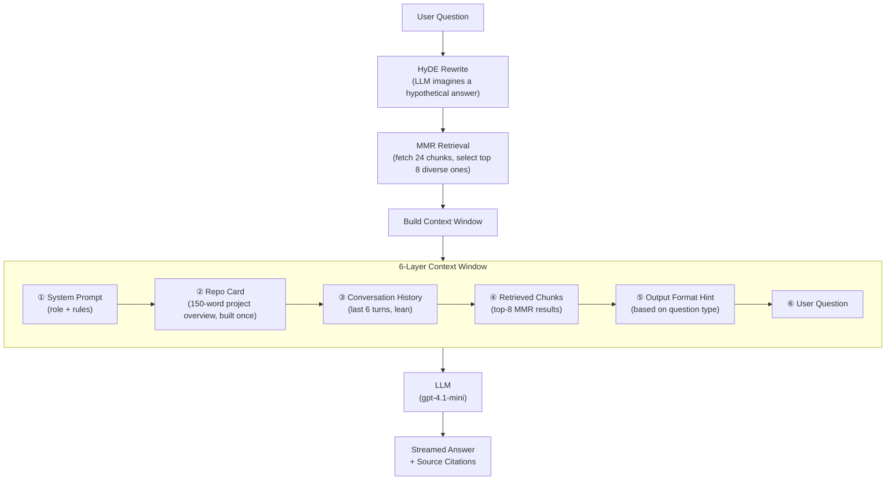

# Week 1 — Daily Deliverables

## Day 1 — Getting Started with Azure OpenAI & Prompt Engineering

**Date:** Day 1

### What I Did

The first day was mostly about getting familiar with the Azure OpenAI environment and running my first real API call. I started by setting up the development environment — installing the necessary packages, configuring the `.env` file with the Azure API keys, and making sure everything connected properly.

Once the setup was done, I moved on to building a small but meaningful script (`summary.py`) that takes a meeting transcript as input and generates a structured summary along with a list of action items — using the `gpt-4.1-mini` model deployed on Azure. The script uses streaming so the response appears token-by-token, which gave me a feel for how LLM outputs actually work in real time.

One thing I specifically focused on was **prompt engineering**. I studied the difference between weak and improved prompts, and included working examples as comments in the code:
- A weak prompt like *"Summarize this document"* vs. a better version that gives the model a role, a format, and a focus area.
- Similarly for extracting action items and classifying feedback.

### Key Implementations
- Connected to Azure OpenAI using the `AzureOpenAI` Python client
- Implemented **streaming** chat completions with `stream=True`
- Built a practical meeting summarizer with system and user roles
- Practiced writing structured, role-based prompts with clear output expectations

### What I Learned
- How to authenticate and call Azure OpenAI endpoints from Python
- The importance of the system prompt in shaping the model's behavior
- How streaming works — tokens come in chunks, not all at once
- Prompt quality directly affects output quality — vague prompts give vague results

---

## Day 2 — Multi-turn Conversations, Pydantic & Structured Output

**Date:** Day 2

### What I Did

Day 2 was about making LLM interactions more reliable and structured. The focus shifted from just getting responses to controlling exactly what shape those responses come in — and validating them properly using **Pydantic**.

**Multi-turn conversation** (`main.py`): Extended the basic API call to handle a real back-and-forth conversation. The message history is built up manually — each user and assistant turn is appended to the messages list before the next call. This made it clear how the model uses the full conversation to keep context.

**Interactive chat loop** (`interactive_chat.py`): Built a working terminal chat where the user types a message, the assistant responds with streaming, and the history is maintained across turns automatically. It exits cleanly when the user types `exit` or `quit`. Simple, but a good way to test how conversation memory works in practice.

**Structured output with Pydantic** (`invoking_llm.py` + `pydantic_validation.py`): This was the core focus of the day. `invoking_llm.py` defined the output schema as a raw JSON dict and used a manual `validate_ticket()` function to check field presence, enum values, and data types. `pydantic_validation.py` took this further using **actual Pydantic**:

- Defined `Category` and `Urgency` as `str, Enum` classes — so invalid values are rejected automatically
- Built a `SupportTicket` Pydantic `BaseModel` with typed fields and `Field` constraints (e.g., `min_length=1`)
- Used LangChain's `PydanticOutputParser` to wire the schema into a `ChatPromptTemplate` and form a clean chain with the `|` operator: `prompt | llm | parser`
- Used `llm.with_structured_output(SupportTicket, method="json_schema")` — LangChain's cleanest way to enforce a Pydantic model as the LLM's output format, with automatic parsing and `ValidationError` handling

**LangChain introduction** (`main_langchain.py`): Got hands-on with LangChain's `AzureChatOpenAI` wrapper and used `SystemMessage` / `HumanMessage` objects to structure calls cleanly. Also explored the idea of a GitHub RAG system — which became the foundation for Days 3 and 4.

### Key Implementations
- Multi-turn conversation history managed in a Python list
- Streaming terminal chat interface with clean exit handling
- JSON schema output enforcement + manual `validate_ticket()` for field and enum checking (`invoking_llm.py`)
- **`pydantic_validation.py`** — proper Pydantic `BaseModel` (`SupportTicket`) with `Category` and `Urgency` `Enum` fields and `Field` constraints
- `PydanticOutputParser` wired into a `ChatPromptTemplate` using the LangChain `|` chain syntax: `prompt | llm | parser`
- `llm.with_structured_output(SupportTicket, method="json_schema")` — automatic parsing and `ValidationError` handling with zero boilerplate

### What I Learned
- There's a real difference between *mimicking* Pydantic with a manual dict check and *using* Pydantic — enums, type coercion, and `Field` constraints do the heavy lifting for you
- `with_structured_output()` is the cleanest way to get a typed Pydantic object back from an LLM call — no manual JSON parsing needed
- The `|` operator in LangChain chains (LCEL) makes it easy to compose prompt → model → parser in a readable, modular way
- Catching `ValidationError` separately from general exceptions is good practice — it tells you exactly which field failed and why

---

## Day 3 — Naive RAG: Understanding the Full Pipeline

**Date:** Day 3

### What I Did

Day 3 introduced **Retrieval-Augmented Generation (RAG)** — instead of asking the LLM to answer from memory, you first pull relevant information from your own documents and include it in the prompt. I explored every stage of the RAG pipeline and built a working version using local policy files (`remote_work_policy.txt`, `travel_expense_policy.txt`, `customer_data_handling_policy.txt`).

The flow is always the same: **load → chunk → embed → store → retrieve → answer**.

---

**Step 1 — Load Documents**

Different loaders handle different file types:

| Loader | What it handles |
|--------|----------------|
| `TextLoader` | Plain `.txt` files |
| `PyPDFLoader` | PDF documents |
| `UnstructuredWordDocumentLoader` | `.docx` Word files |
| `CSVLoader` | Spreadsheet / CSV data |

Used `TextLoader` to load the three policy text files.

---

**Step 2 — Chunk Documents**

Long documents need to be split into smaller pieces before they can be embedded. Three common splitters:

- **`CharacterTextSplitter`** — splits at a specific character (e.g., `\n\n`), fast and simple
- **`TokenTextSplitter`** — splits by token count, maps directly to what the model sees
- **`RecursiveCharacterTextSplitter`** — tries natural boundaries first (paragraphs → sentences → words) before falling back to characters; the most commonly used option *(used here)*

Two settings that matter:
- **`chunk_size`** — the max length of each chunk (characters or tokens). Bigger = more context per chunk, but fewer chunks fit in the prompt.
- **`chunk_overlap`** — how much text is shared between adjacent chunks. Prevents losing context that falls right at a boundary.

Used `RecursiveCharacterTextSplitter(chunk_size=1000, chunk_overlap=200)`.

---

**Step 3 — Embed Chunks**

Each chunk is converted into a vector that captures its meaning. Similar chunks land close together in vector space. Common options:

| Embedding | Notes |
|-----------|-------|
| `AzureOpenAIEmbeddings` | Azure-hosted OpenAI *(used here)* |
| `OpenAIEmbeddings` | Standard OpenAI API |
| `CohereEmbeddings` | Cohere's models |
| `GoogleGenerativeAIEmbeddings` | Google's API |
| `HuggingFaceEmbeddings` | Open-source, runs locally |

---

**Step 4 — Store in a Vector Database**

Embedded chunks go into a vector store that searches by meaning, not keywords:

| Vector Store | Notes |
|-------------|-------|
| **Chroma** | Local, file-based, great for dev *(used here)* |
| **Pinecone** | Cloud-hosted, scalable |
| **Milvus** | Open-source, high-performance |
| **pgvector** | Vector search inside PostgreSQL |
| **MongoDB Atlas** | Vector search inside MongoDB |

---

**Step 5 — Retrieve**

When a user asks a question, it gets embedded and the closest chunks are fetched. Common strategies:

- **Similarity Search** — returns chunks whose vectors are closest to the question
- **Semantic Search** — same idea, focused on meaning over keywords
- **MMR (Maximum Marginal Relevance)** — picks chunks that are both relevant *and* diverse; avoids returning near-duplicate results

Two key retrieval settings:
- **Top-K (`k`)** — how many chunks to send to the LLM (typically 3–7). Too few = missing context; too many = noisy prompt.
- **Score Threshold** — a minimum similarity score (e.g., 0.75). If nothing is relevant enough, the system returns nothing rather than forcing irrelevant data on the LLM.

---

### Key Implementations
- Loaded policy docs with `TextLoader` and chunked with `RecursiveCharacterTextSplitter`
- Embedded chunks with `AzureOpenAIEmbeddings` and stored in an in-memory vector store
- Ran a `similarity_search` query to retrieve and print the most relevant policy chunks
- Understood the trade-offs between all three splitters and both retrieval strategies

### What I Learned
- RAG has one job: get the right context in front of the model before it answers
- `chunk_size` and `chunk_overlap` are small settings with a big impact on answer quality
- The choice of splitter matters — recursive splitting respects natural language boundaries far better than character-based splitting
- Top-K and Score Threshold are the two knobs that control what the LLM actually sees
- Naive RAG is a great starting point, but the gaps become obvious quickly — which is exactly what Day 4 addresses

---

## Day 4 — Context Engineering: Making the RAG System Actually Useful

**Date:** Day 4

### What I Did

Day 4 tackled the biggest weakness of the naive RAG system from Day 3 — the quality of what gets sent to the LLM. Getting a response isn't hard; getting a *good* response consistently is. That's where **context engineering** comes in. Rather than just dumping retrieved chunks into the prompt, the goal was to deliberately design every layer of the context window so the model always has the right information, in the right order, at the right level of detail.

**Structured 6-layer context window** (`qa_engine.py`): Every single query to the LLM now follows a fixed, deliberate structure:
1. **System prompt** — sets the model's role and rules (cite files, don't hallucinate, use markdown)
2. **Repo card** — a 150-word summary of the entire repository generated *once* after ingestion and pinned to the top of every query
3. **Conversation history** — a sliding window of the last 6 turn pairs, stored lean (no injected context, just raw Q&A)
4. **Retrieved chunks** — the actual code retrieved from ChromaDB
5. **Output format hint** — dynamically selected based on question intent (e.g., "where" questions get a different format hint than "explain" questions)
6. **User question**

This is the core idea of context engineering: the model's output quality is determined by how well you assemble its input, not just which chunks you retrieved.

**HyDE — Hypothetical Document Embedding** (`qa_engine.py`): Instead of searching the vector store with the raw user question, the model is first asked to *imagine* a hypothetical answer. That hypothetical answer is then used as the search query. Since it's written in the same style as the actual code chunks, it retrieves far more relevant results than a plain question would.

**MMR — Maximum Marginal Relevance** (`qa_engine.py`): Replaced basic similarity search with MMR retrieval (`max_marginal_relevance_search`). It pulls a larger candidate pool (24 chunks) and then selects the top 8 that are both relevant *and* diverse — avoiding situations where five of the eight chunks are near-duplicates of each other.

**Repo card** (`qa_engine.py`): Right after ingestion, the LLM reads the directory tree and README to generate a short overview of the project. This is injected into every subsequent query so the model always has a bird's-eye view of what it's working with, no matter which specific chunks were retrieved. Analogies used in the comments: the directory tree is a map, docs are a guidebook, code chunks are the detailed pages, and the dependency graph shows how everything connects.

**Dynamic format hints** (`qa_engine.py`): A simple keyword-based router that detects what kind of question was asked and adjusts the output format accordingly — architecture questions get bullet-point summaries, "where" questions get file paths first, "explain" questions get a three-part structure (plain English → code snippet → related files), and so on.

**Dependency and import cleanup** (`ingest.py`, `requirements.txt`): Migrated from deprecated LangChain paths (`langchain.schema`) to the current stable ones (`langchain_core.documents`, `langchain_text_splitters`), and wrote a clean `requirements.txt` to make the project reproducible.

### Context-Engineered RAG Flow

### Key Implementations
- Deliberate 6-layer context window — every component has a specific position and purpose
- Repo card built once post-ingestion, reused in every query for stable high-level context
- **HyDE query rewriting** — generates a hypothetical answer to improve retrieval quality
- **MMR search** — balances relevance and diversity across retrieved chunks
- Dynamic output format hints based on question-type detection
- Windowed conversation history — last 6 turns kept lean (no redundant context bloat)
- Source citations automatically appended after every streamed response

### What I Learned
- **Context engineering is just as important as retrieval** — a well-structured prompt makes a bigger difference than a slightly better embedding model
- HyDE is surprisingly effective: imagining the answer before searching finds much better matches than searching with the raw question
- MMR solves a real problem — plain top-k retrieval often returns redundant chunks that waste context window space
- Pinning a stable repo card at the top of every query gives the model consistent grounding, even when retrieved chunks vary widely
- The output format hint idea is simple but impactful — the model shapes its response differently when you tell it what structure you expect

---

## Weekly Summary

| Day | Focus Area | Key Output |
|-----|-----------|------------|
| Day 1 | Azure OpenAI setup & Prompt Engineering | `summary.py` — meeting summarizer with streaming |
| Day 2 | Multi-turn chat, Pydantic structured validation & output parsing | `interactive_chat.py`, `invoking_llm.py`, `main_langchain.py` |
| Day 3 | Naive RAG — from local documents to GitHub repos | `rag.py` (policy docs), `ingest.py`, `qa_engine.py`, `app.py` |
| Day 4 | Context Engineering — HyDE, MMR, repo card, format hints | Refined `qa_engine.py` with a deliberate 6-layer context window |

**Technologies used this week:** Python, Azure OpenAI (GPT-4.1-mini, text-embedding-ada-002), LangChain, ChromaDB, GitPython, Streamlit, Pydantic, dotenv

---
